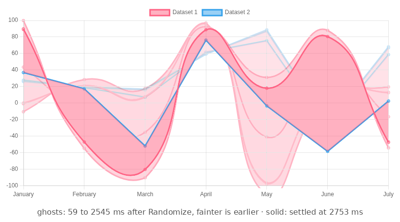

# skills 🧰

Agent skills. Drop a folder into your agent's skills directory (`~/.claude/skills/` for Claude Code) and go.

| Skill | Does |
| --- | --- |
| 🎞️ [temporal-browser-observation](temporal-browser-observation/SKILL.md) | Watches a web page over time, because a screenshot taken 40 ms after the click is not a bug report. 🙄 |

The [Chart.js drop sample](https://www.chartjs.org/docs/latest/samples/animations/drop.html) after clicking Randomize. At 992 ms the blue line is done and the pink one hasn't moved yet. Screenshot then and half your chart is lying. 🫠
